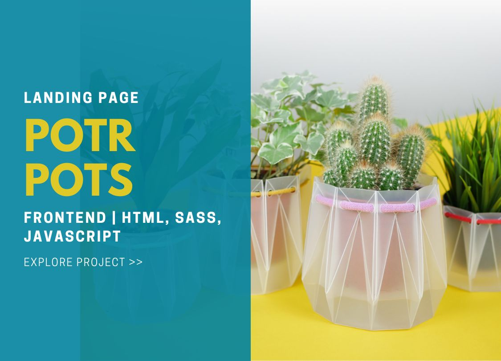

# Project Summary: POTR POTS Frontend Development

I took on the demanding task of coding the **frontend** for the POTR pots landing page, a project embedded within a comprehensive course. Focused on the complexity of the design, I navigated through intricate layout modifications necessary for optimal display across diverse devices. The project also featured highly interactive sections, adding an additional layer of complexity to the coding challenge. This experience not only showcased my coding skills but also provided an invaluable learning opportunity. It allowed me to implement all key concepts of styling websites in CSS, demonstrating adaptability in addressing the nuances of modern web design and user interaction. This hands-on project significantly enriched my understanding and application of styling techniques, contributing to a well-rounded learning experience.

## Key Features:

**Responsive Design:** The desktop and tablet versions present a refined design reminiscent of design magazine pages. I prioritized adaptability by carefully defining element distances from edges while preserving cohesive relationships. The mobile version, tailored for smaller screens, features a fluid design to optimize user experience.

**SASS Animations:** I elevated user engagement by integrating subtle animations using SASS, introducing interactive elements like smoothly sliding menu or materials section. This segment necessitates user interaction to unveil content, complemented by Polaroid photos that elegantly rotate and zoom upon mouse hover. Additionally, I implemented buttons with gently animated backgrounds to further enhance the user experience.

**Form Validation:** Ensured a seamless user experience with a validated input form at the bottom, fields are styled also for autofill functionality.

**Smart Link Actions:** Integrated links in the address section to initiate relevant actions, such as making a call, sending an email, or displaying the location in Google Maps.

**Code Quality:** Prioritized clean and maintainable code, fostering efficiency in development and paving the way for future enhancements. Implemented variables, mixins, and adhered to BEM methodology. Implemented semantic HTML to enhance maintainability and accessibility, ensuring a more inclusive user experience.

## Explore the Project:

**Demo Version:** [DEMO](https://meljaszuk.github.io/Responsive-Webiste-EcoPots/)

**Code Repository:** [CODE](https://github.com/meljaszuk/Responsive-Webiste-EcoPots/tree/main/src)

**Figma Design:** [FIGMA](https://www.figma.com/file/50zgLU65Mcd3MisFHMfLfx/POTR-POTS_FE-students?node-id=1760%3A281)
